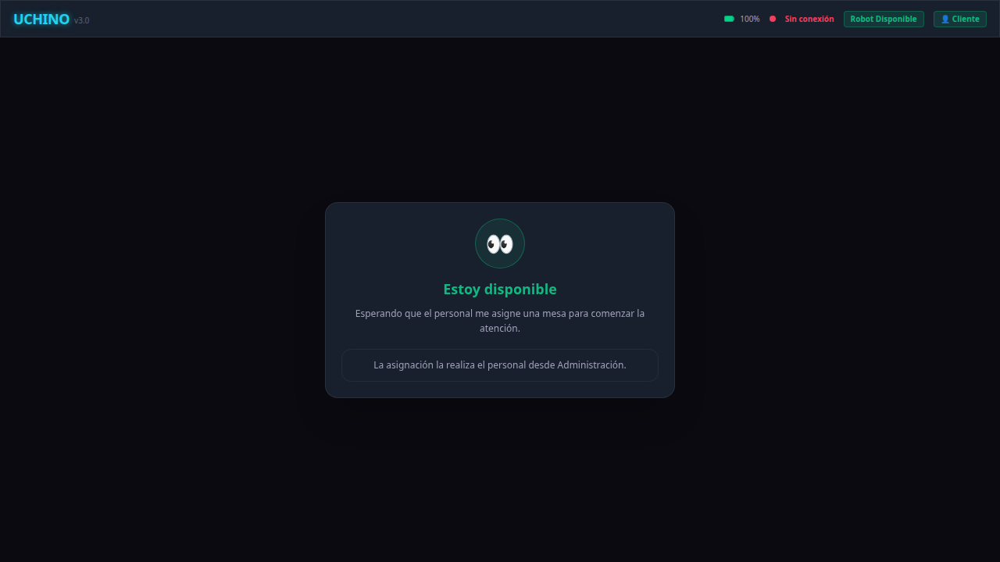
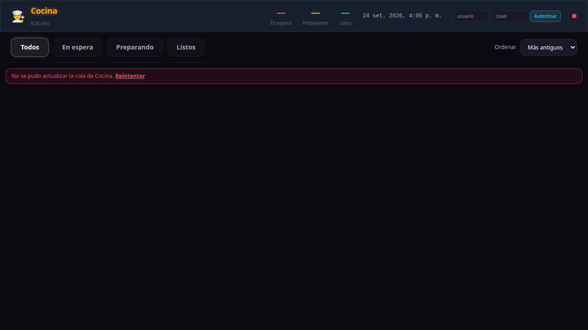
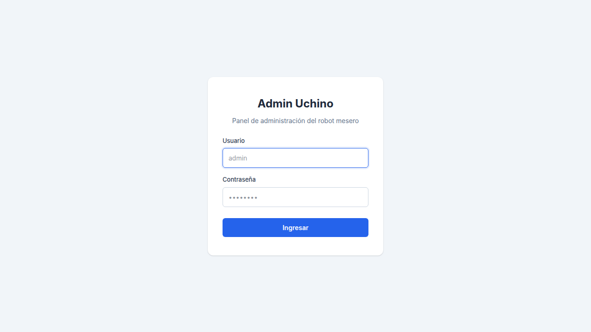

# UCHINO Robot Mesero

Proyecto de tesis y publicación abierta del PLN y la interfaz web del robot mesero UCHINO. Esta copia está preparada para que una persona pueda revisar las páginas, ejecutar el backend local y entender qué servicios externos debe configurar.

## Qué contiene esta publicación

| Ruta | Nombre claro | Para qué sirve |
|---|---|---|
| `workspace_laptop/v3_core/frontend_ui` | Interfaz web | Pantallas `/robot`, `/cocina` y `/admin` |
| `workspace_laptop/v3_core/backend_api` | Backend y API | Express, WebSocket y reglas de negocio |
| `workspace_laptop/v3_core/memory_db` | Memoria y datos | PostgreSQL, SQLite, migraciones y repositorios |
| `workspace_laptop/v3_core/orchestrator` | Orquestador | FastAPI y coordinación del diálogo |
| `workspace_laptop/v3_core/dialogue` / `pln` | Lenguaje natural | Estados conversacionales e intenciones |
| `workspace_laptop/v3_core/docker` | Infraestructura | PostgreSQL, Redis, ChromaDB, InfluxDB y Grafana |
| `render.yaml` | Despliegue cloud | Configuración base para Render |

Es la publicación PLN/web. No incluye navegación física, firmware ESP32, modelos pesados, credenciales ni artefactos de compilación. La simulación y la interfaz funcionan sin hardware; el robot físico requiere el workspace ROS2/RPi5 correspondiente y una red real.

## Comenzar en pocos pasos

La guía completa está en [`docs/GUIA_PUBLICA.md`](docs/GUIA_PUBLICA.md). El camino corto es:

```bash
git clone https://github.com/daca2022/UCHINO_ROBOT_MESERO.git
cd UCHINO_ROBOT_MESERO/workspace_laptop/v3_core
cp .env.example .env
# Edita .env: ADMIN_PASSWORD, JWT_SECRET, POSTGRES_PASSWORD,
# INFLUX_TOKEN y GF_SECURITY_ADMIN_PASSWORD.
bash start_web.sh
```

Después abre:

- `http://localhost:3005/robot`
- `http://localhost:3005/cocina`
- `http://localhost:3005/admin`

Para comprobar el servicio:

```bash
curl http://localhost:3005/api/status
```

## Credenciales y servicios opcionales

Las variables se declaran en [`workspace_laptop/v3_core/.env.example`](workspace_laptop/v3_core/.env.example). Los valores reales se guardan únicamente en el archivo local ignorado `.env`; la explicación de cada variable está en [`CREDENTIALS.md`](workspace_laptop/v3_core/shared/credentials/CREDENTIALS.md).

La interfaz y el backend pueden abrirse sin una clave de LLM. Para respuestas generativas y visión cloud se necesita una clave propia de OpenRouter. TTS local, STT WhisperLiveKit, Ollama, cámara, ROS2 y el robot físico son componentes adicionales: sus modelos, entornos o equipos no se distribuyen en este repositorio. La guía marca cada requisito para no confundir “página visible” con “sistema de voz completo”.

## Scripts principales

| Script | Uso | ¿Es necesario para revisar la web? |
|---|---|---|
| `start_web.sh` | Docker + API + páginas web | Sí, es el arranque recomendado |
| `start_robot.sh` | Stack completo local, incluidos sidecars de voz si están instalados | No; requiere dependencias externas |
| `start_ui.sh` | Vite en desarrollo o preview | Solo para desarrollar la interfaz |
| `start_pln.sh` | Servicio PLN Python aislado | Opcional |
| `start_pipeline.sh` | Wake word y limpieza de audio | Opcional; necesita `WhisperLiveKit/venv` |
| `start_stt.sh` | WhisperLiveKit en el puerto 8002 | Opcional; necesita instalación y modelo |
| `stop_robot.sh` | Detiene API, sidecar y Docker | Úsalo al terminar una sesión local |

Los scripts de `scripts/` son utilidades de pruebas, migración o diagnóstico; no son pasos adicionales obligatorios del arranque básico.

## Capturas de la aplicación

Las imágenes se tomaron desde el build local actual en una ventana de 1280×720. Robot y Cocina muestran estados degradados observables sin sesión autenticada: Robot indica `Sin conexión` y Cocina indica que su cola no se pudo actualizar. No se presentan como una aceptación saludable del backend; la verificación HTTP separada está descrita en la guía.

### Robot



### Cocina



### Administración



## Estado reproducible

- Build de la interfaz: `npm --prefix workspace_laptop/v3_core/frontend_ui run build` verificado.
- Backend y rutas `/robot`, `/cocina`, `/admin`: verificados localmente con Node.js 22.
- Persistencia local: SQLite se crea automáticamente; PostgreSQL, Redis, ChromaDB, InfluxDB y Grafana se levantan con Docker.
- Cloud: `render.yaml` contiene el servicio Node y marca secretos con `sync: false`; para producción se deben configurar también las bases administradas.
- Hardware y voz: no se declaran como disponibles si faltan sus modelos, entornos o equipos.

## Para tesis y contribuciones

Consulta [`docs/GUIA_PUBLICA.md`](docs/GUIA_PUBLICA.md) para arquitectura, pruebas, variables, modos de ejecución, publicación cloud y límites de la demostración. Las reglas para colaborar están en [`CONTRIBUTING.md`](CONTRIBUTING.md) y la licencia en [`LICENSE`](LICENSE).

Esta guía y este README son la documentación pública de referencia. Las notas que viven dentro de cada módulo son documentación técnica o histórica y no sustituyen el quickstart.
