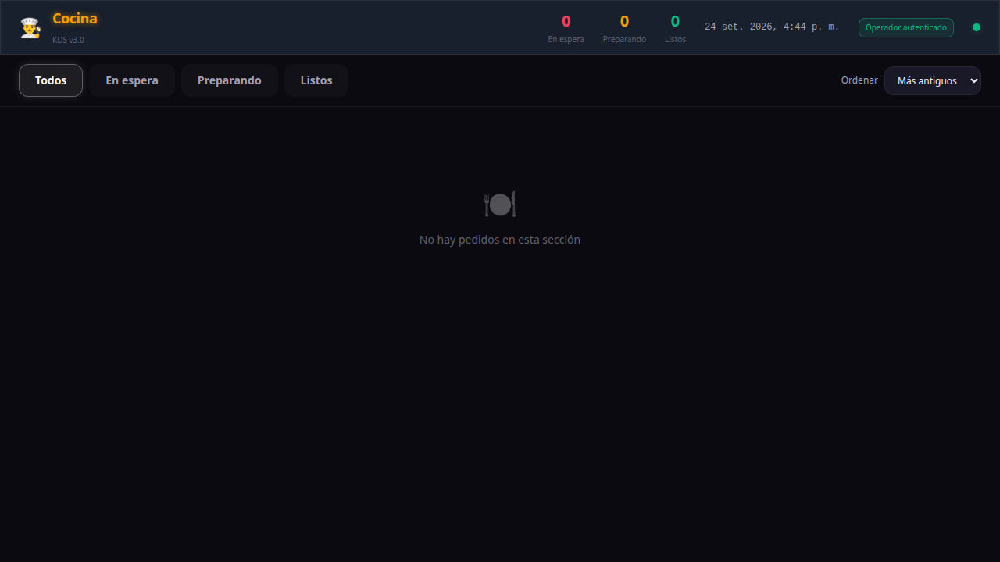
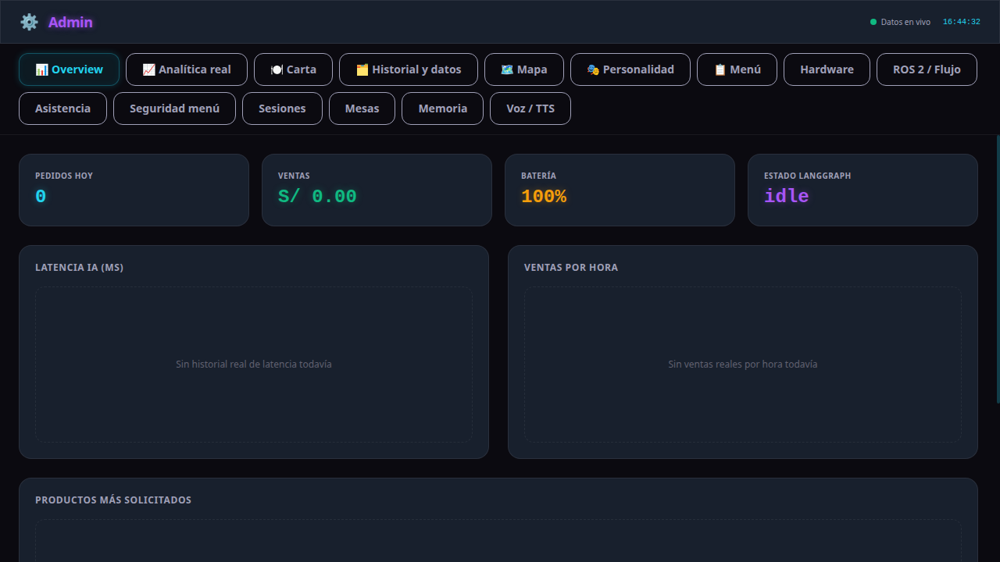
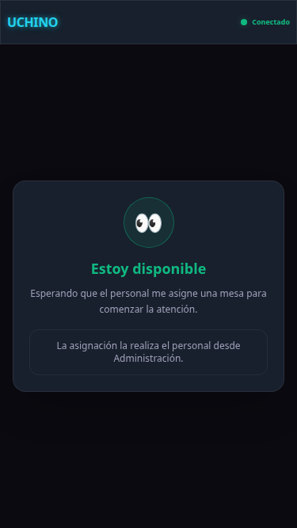
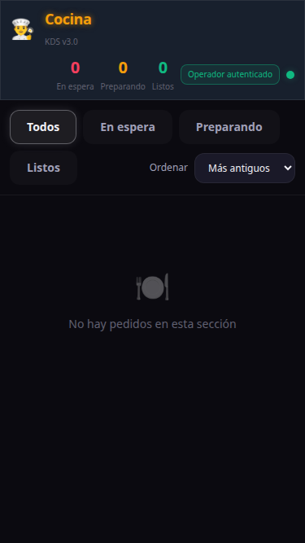

# UCHINO Robot Mesero

Proyecto de tesis y publicación abierta del PLN y la interfaz web del robot mesero UCHINO. Esta copia está preparada para que una persona pueda revisar las páginas, ejecutar el backend local y entender qué servicios externos debe configurar.

## El recorrido de Uchino

Uchino no es solo una pantalla: es un recorrido completo desde que una mesa pide atención hasta que Cocina recibe el pedido. Esta publicación conserva ese recorrido en una forma que se puede clonar y probar en una laptop.

| Parte | Qué hace en la demostración | Qué vas a ver |
|---|---|---|
| **Robot** | Presenta el menú, asigna mesa, recibe el pedido por pantalla o voz y muestra el estado conversacional. | `/robot`, carrito y estados `Escuchando → Procesando → Por confirmar`. |
| **Cocina** | Convierte los pedidos confirmados en una cola operativa para preparar y marcar como listos. | `/cocina`, filtros `En espera`, `Preparando` y `Listos`. |
| **Administración** | Revisa métricas, carta, pedidos, mesas, asistencia, memoria y el flujo ROS2 simulado. | `/admin`, protegida por usuario y contraseña. |
| **Cerebro** | Une la API, reglas de pedido, sesiones, memoria, WebSocket y el LLM opcional. | `backend_api`, `memory_db`, `dialogue` y `pln`. |
| **Infraestructura** | Guarda datos y telemetría para que las pantallas no dependan de datos inventados. | PostgreSQL, Redis, ChromaDB, InfluxDB y Grafana. |

La simulación web es la forma más rápida de recorrer el sistema. La navegación física, el firmware y los modelos grandes de voz pertenecen a los workspaces de hardware y no se copian dentro de este repositorio público.

## Qué contiene esta publicación

| Ruta | Nombre claro | Para qué sirve |
|---|---|---|
| `workspace_laptop/v3_core/frontend_ui` | Interfaz web | Pantallas `/robot`, `/cocina` y `/admin` |
| `workspace_laptop/v3_core/backend_api` | Backend y API | Express, WebSocket y reglas de negocio |
| `workspace_laptop/v3_core/memory_db` | Memoria y datos | PostgreSQL, SQLite, migraciones y repositorios |
| `workspace_laptop/v3_core/orchestrator` | Orquestador | FastAPI y coordinación del diálogo |
| `workspace_laptop/v3_core/dialogue` / `pln` | Lenguaje natural | Estados conversacionales e intenciones |
| `workspace_laptop/v3_core/docker` | Infraestructura | PostgreSQL, Redis, ChromaDB, InfluxDB y Grafana |
| `render.yaml` | Despliegue cloud | Configuración base para Render |

Es la publicación PLN/web. No incluye navegación física, firmware ESP32, modelos pesados, credenciales ni artefactos de compilación. La simulación y la interfaz funcionan sin hardware; el robot físico requiere el workspace ROS2/RPi5 correspondiente y una red real.

## Comenzar en pocos pasos

La guía completa está en [`docs/GUIA_PUBLICA.md`](docs/GUIA_PUBLICA.md). El camino corto es:

```bash
git clone https://github.com/daca2022/UCHINO_ROBOT_MESERO.git
cd UCHINO_ROBOT_MESERO/workspace_laptop/v3_core
cp .env.example .env
# Edita .env: ADMIN_PASSWORD, JWT_SECRET, POSTGRES_PASSWORD,
# INFLUX_TOKEN y GF_SECURITY_ADMIN_PASSWORD.
bash start_web.sh
```

Después abre:

- `http://localhost:3005/robot`
- `http://localhost:3005/cocina`
- `http://localhost:3005/admin`

Para comprobar el servicio:

```bash
curl http://localhost:3005/api/status
```

## Credenciales y servicios opcionales

Las variables se declaran en [`workspace_laptop/v3_core/.env.example`](workspace_laptop/v3_core/.env.example). Los valores reales se guardan únicamente en el archivo local ignorado `.env`; la explicación de cada variable está en [`CREDENTIALS.md`](workspace_laptop/v3_core/shared/credentials/CREDENTIALS.md).

La interfaz y el backend pueden abrirse sin una clave de LLM. Para respuestas generativas y visión cloud se necesita una clave propia de OpenRouter. Las credenciales se colocan únicamente en `.env`; nunca en el código ni en el README.

### Voz: qué funciona al clonar

- **STT básico sin descargar modelos:** en Chrome o Edge, `/robot` usa el reconocimiento de voz del navegador después de conceder permiso al micrófono. El texto se envía al mismo endpoint de pedido que usa la pantalla.
- **TTS básico sin descargar modelos:** si el TTS local no está disponible, el navegador reproduce la respuesta en español mediante `speechSynthesis`. Por eso el recorrido de voz puede probarse en una laptop limpia.
- **Voz avanzada opcional:** WhisperLiveKit, Piper/Kokoro y sus modelos mejoran privacidad, latencia y calidad, pero requieren instalaciones y descargas adicionales. El clon no finge incluir varios gigabytes de modelos.
- **LLM opcional:** añade `OPENROUTER_API_KEY` para respuestas generativas cloud. Sin ella, todavía puedes abrir las páginas y probar el flujo de pedido con los servicios locales disponibles.

## Scripts principales

| Script | Uso | ¿Es necesario para revisar la web? |
|---|---|---|
| `start_web.sh` | Docker + API + páginas web | Sí, es el arranque recomendado |
| `start_robot.sh` | Stack completo local, incluidos sidecars de voz si están instalados | No; requiere dependencias externas |
| `start_ui.sh` | Vite en desarrollo o preview | Solo para desarrollar la interfaz |
| `start_pln.sh` | Servicio PLN Python aislado | Opcional |
| `start_pipeline.sh` | Wake word y limpieza de audio | Opcional; necesita `WhisperLiveKit/venv` |
| `start_stt.sh` | WhisperLiveKit en el puerto 8002 | Opcional; necesita instalación y modelo |
| `stop_robot.sh` | Detiene API, sidecar y Docker | Úsalo al terminar una sesión local |

Los scripts de `scripts/` son utilidades de pruebas, migración o diagnóstico; no son pasos adicionales obligatorios del arranque básico.

## Capturas de una sesión funcional

Estas capturas se tomaron el **24 de septiembre de 2026** desde el build público ejecutado en una laptop, con el backend local activo. No son mockups: muestran las rutas servidas por Express y la sesión que se usó para validarlas.

### Robot


La etiqueta verde `Conectado` confirma el WebSocket de la interfaz. En este momento el robot está disponible y espera que Administración le asigne una mesa.

### Cocina



La cola está vacía de forma saludable: los contadores muestran cero y aparece `No hay pedidos en esta sección`. Un pedido confirmado desde `/robot` aparecería aquí sin recargar la página.

### Administración



El dashboard muestra métricas, estado LangGraph, carta, historial, mapa, asistencia, memoria y el panel `Voz / TTS`. Para entrar se usan `ADMIN_USER` y `ADMIN_PASSWORD` del `.env` local.

### Vista estrecha




Las imágenes anteriores (`robot.png`, `cocina.png` y `admin.png`) se conservan como estados de diagnóstico y acceso inicial. Sirven para reconocer fallos de conexión o la pantalla de login; las capturas `*-live.png` son las referencias principales de funcionamiento.

## Estado reproducible

- Build de la interfaz: `npm --prefix workspace_laptop/v3_core/frontend_ui run build` verificado.
- Backend y rutas `/robot`, `/cocina`, `/admin`: verificados localmente con Node.js 22.
- WebSocket de Robot, cola autenticada de Cocina y dashboard autenticado de Administración: verificados en la sesión local que produjo las capturas `*-live.png`.
- STT/TTS de navegador: la ruta base está integrada en `/robot`; Chrome/Edge requieren permiso de micrófono y audio.
- Persistencia local: SQLite se crea automáticamente; PostgreSQL, Redis, ChromaDB, InfluxDB y Grafana se levantan con Docker.
- Cloud: `render.yaml` contiene el servicio Node y marca secretos con `sync: false`; para producción se deben configurar también las bases administradas.
- Hardware y voz: no se declaran como disponibles si faltan sus modelos, entornos o equipos.

## Para tesis y contribuciones

Consulta [`docs/GUIA_PUBLICA.md`](docs/GUIA_PUBLICA.md) para arquitectura, pruebas, variables, modos de ejecución, publicación cloud y límites de la demostración. Las reglas para colaborar están en [`CONTRIBUTING.md`](CONTRIBUTING.md) y la licencia en [`LICENSE`](LICENSE).

Esta guía y este README son la documentación pública de referencia. Las notas que viven dentro de cada módulo son documentación técnica o histórica y no sustituyen el quickstart.
